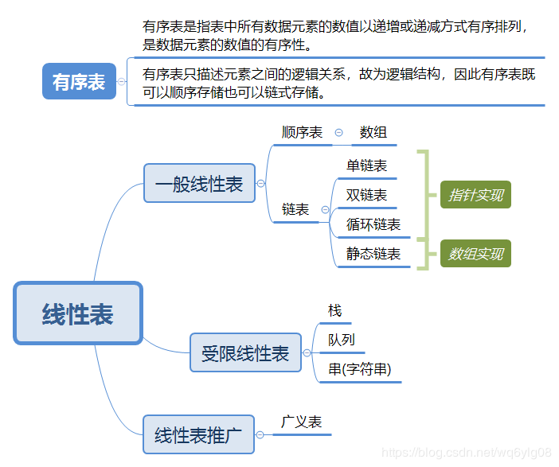

## 额外练习
### H1:Python入门

22359: Goldbach Conjecture

http://cs101.openjudge.cn/dsapre/22359/

```python
import math

def is_prime(x):
    if x < 2:
        return False
    for i in range(2, int(math.sqrt(x)) + 1):
        if x % i == 0:
            return False
    return True

N = int(input())

found = False
for a in range(N):
    b = N - a
    if is_prime(a) and is_prime(b):
        print(a, b)
        found = True
        break
```

02039: 反反复复

http://cs101.openjudge.cn/dsapre/02039/

```python
n = int(input())
alist = input().lower()
a = len(alist)
b = a//n

matrix = [['' for _ in range(n)] for _ in range(b)]
#填充矩阵
index = 0
for row in range(b):
    if row % 2 == 0:  #偶数行从左到右填充
        for col in range(n):
            matrix[row][col] = alist[index]
            index += 1    
            
    else: #奇数行从右到左填充
        for col in range(n-1,-1,-1):
            matrix[row][col] = alist[index]
            index += 1
            
result = ''
for col in range(n):
    for row in range(b):
        result += matrix[row][col]
print(result)
```

22548: 机智的股民老张

http://cs101.openjudge.cn/dsapre/22548/

```python
def max_profit(prices):
    if not prices:
        return 0
    
    min_price = float('inf')
    max_profit = 0
    
    for price in prices:
        if price < min_price:
            min_price = price
        elif price - min_price > max_profit:
            max_profit = price - min_price
            
    return max_profit

a = list(map(int, input().split()))
print(max_profit(a))
```

23563: 多项式时间复杂度

http://cs101.openjudge.cn/practice/23563/

```python
n = list(input().split('+')) #['6n^2','5n^3']
c = []
result = 0

for i in n:
    a,b = i.split("n^")
    c.append((a,b))

for i in c:
    if i[0] != "0" and int(i[1]) > result:
        result = int(i[1])

print("n^{}".format(result))
```

### H2:线性表



05345: 位查询

http://cs101.openjudge.cn/dsapre/05345/

```python
def modify(n,d):
    for i in range(len(n)):
        n[i] = (n[i] + d) % 65536

def count_bits(n,i):
    count = 0
    for num in n:
        if (num >> i) & 1:  
            count += 1
    return count

'''   
这里的>>是右移运算符，表示将数字右移i位。
右移i位后，最低位（即第i位）上的值会移到最右边，然后用&1进行按位与操作
结果为1表示第i位为1，结果为0表示第i位为0。
'''  

N,M = map(int,input().split())
n = list(map(int,input().split()))

for _ in range(M):
    act,num = input().split()
    if act == 'Q':
        i = int(num)
        result = count_bits(n,i)
        print(result)
    elif act == 'C':
        d = int(num)
        modify(n,d)
```

05344: 最后的最后

http://cs101.openjudge.cn/dsapre/05344/

*约瑟夫斯问题

```python
from collections import deque
n,k = map(int,input().split())
queue = deque(x for x in range(1,n+1))
res = []

while len(queue) >= 2:
    for _ in range(k-1):
        a = queue.popleft()
        queue.append(a)
    b = queue.popleft()
    res.append(b)
    
print(*res)
```

05467: 多项式加法

http://cs101.openjudge.cn/dsapre/05467/

```python
from collections import defaultdict

def solve(a):
    i = 0
    while i < len(a):
        m, n = a[i], a[i + 1]
        if n < 0:
            break
        res[n] += m
        i += 2

n = int(input())        
for _ in range(n):
    res = defaultdict(int)
    solve(list(map(int, input().split())))
    solve(list(map(int, input().split())))
    
    result = []
    for i in sorted(res, reverse=True):
        if res[i] != 0:
            result.append(f'[ {res[i]} {i} ]')

    print(' '.join(result))
```

07297: 神奇的幻方

http://cs101.openjudge.cn/dsapre/07297/

```python
n = int(input())

def solve(n):
    m = (n*2)-1
    matrix = [[0]*m for _ in range(m)]
    
    num = 1
    i,j = 0,n-1

    while num <= m * m:
        matrix[i][j] += num
        num += 1
        
        next_i,next_j = (i-1) % m,(j+1) % m #(i-1)%m，如果当前数字在第一行，上移会导致索引变为-1，取模m后会变成m-1
            
        if matrix[next_i][next_j] != 0:
            next_i,next_j = (i + 1) % m,j
            
        i,j = next_i,next_j
        
    for row in matrix:
        return (' '.join(map(str,row)))
        
print(solve(n))
```

21006: 放苹果（盘子相同）

http://cs101.openjudge.cn/dsapre/21006/

```python
m,n = map(int,input().split()) #m=apples,n=plates

dp = [[0]*(m+1) for i in range(n+1)]
#因为无论是把0个苹果放入几个盘子，还是把任意个苹果放入0个盘子，放法数目都是1。
for i in range(1,n+1):
    dp[i][0] = 1   
dp[1] = [1] * (m+1)
#1个盘子，放法数目都为1
for i in range(1,n+1):
    dp[i][1] = 1
    
for i in range(1,n+1):
    for j in range(1,m+1):
        if i > j:
            dp[i][j] = dp[i][j]
        else:
            dp[i][j] = dp[i-1][j]+dp[i][j-i]
            
print(dp[n][m])
```

22068: 合法出栈序列

http://cs101.openjudge.cn/dsapre/22068/

```python
def find(x,test):
    if len(x) != len(test):
        return False
    
    stack = []
    bank = list(x)
    
    for char in test:
        while (not stack or stack[-1] != char) and bank:
            stack.append(bank.pop(0))
            
        if not stack or stack[-1] != char:
            return False
        
        stack.pop()
        
    return True

x = input().strip()

while True:
    try:
        test = input().strip()
        if find(x,test):
            print('YES')
        else:
            print('NO')
            
    except EOFError:
        break
```

23451: 交互四则运算计算器_带错误表达式版

http://cs101.openjudge.cn/dsapre/23451/

### H3: 递归与动态规划

04117: 简单的整数划分问题

http://cs101.openjudge.cn/practice/04117/

```python
while True:
    try:
        n = int(input())
    except EOFError:
        break
    
    dp = [[0]*(n+1) for _ in range(n+1)]
    
    for i in range(n+1):
        dp[i][1] = 1
        dp[0][i] = 1
        dp[1][i] = 1
    
    for i in range(1,n+1):
        for j in range(2,n+1): #第一列已经初始化了
            if i >= j:
                dp[i][j] = dp[i-j][j] + dp[i][j-1] #i>=j时，考虑包含j或不包含j的情况。如果包含j则需要在剩余的 i-j 中找到一系列最大整数为 j 的正整数之和
            else: #i<=j时，不能将整数i表示为一系列最大整数为j的正整数之和
                dp[i][j] = dp[i][i]
    
    print(dp[n][n])
```

02773: 采药

http://cs101.openjudge.cn/practice/02773/

08780: 拦截导弹

http://cs101.openjudge.cn/dsapre/02945/

```python
k = int(input())
bomb = list(map(int,input().split()))
dp = [1]*k


for i in range(1,k):
    for j in range(i):
        if bomb[i] <= bomb[j]:
            dp[i] = max(dp[i],dp[j]+1)
            
print(max(dp))
```

22636: 修仙之路

http://cs101.openjudge.cn/dsapre/22636/

```python
def dfs(matrix,visited,r,c,i,j):
    visited[i][j] = True
    directions = [(0,1),(1,0),(0,-1),(-1,0)]
    max_length = 1
    
    for dx,dy in directions:
        x,y = i+dx,j+dy
        if 0 <= x < r and 0 <= y < c and matrix[x][y] > matrix[i][j] and not visited[x][y]:
            max_length = max(max_length,1+dfs(matrix,visited,r,c,x,y)) #找比周围都大的
            
    visited[i][j] = False
    return max_length

def longest_length(matrix,r,c):
    max_length = 0
    visited = [[False]*c for _ in range(r)]
    
    for i in range(r):
        for j in range(c):
            max_length = max(max_length,dfs(matrix,visited,r,c,i,j)) #找整个matrix中最大的
            
    return max_length

r,c = map(int,input().split())
matrix = []
for _ in range(r):
    l = list(map(int,input().split()))
    matrix.append(l)
    
result = longest_length(matrix,r,c)
print(result)
```

24375: 小木棍

http://cs101.openjudge.cn/dsapre/24375/

25815: 回文字符串

http://cs101.openjudge.cn/dsapre/25815/

```python
S = input()
n = len(S)
dp = [[0 for _ in range(n)]for _ in range(n)]

for length in range(1,n):
    for i in range(n-length):
        j = i+length
        
        if S[i] == S[j]:
            dp[i][j] = dp[i+1][j-1]
        else:
            dp[i][j] = min(dp[i+1][j],dp[i][j-1],dp[i+1][j-1]) + 1 #插入、删除、修改
            
print(dp[0][-1])

```
20650: 最长的公共子序列的长度

http://cs101.openjudge.cn/dsapre/20650/

```python
a = list(input())
b = list(input())

dp = [[0 for _ in range(len(a)+1)]for _ in range(len(b)+1)]

for i in range(len(b)):
    for j in range(len(a)):
        if b[i] == a[j]:
            dp[i+1][j+1] = dp[i][j] + 1
        else:
            dp[i+1][j+1] = max(dp[i+1][j],dp[i][j+1])
            
print(dp[len(b)][len(a)])
```

### H4: 查找与排序

07745: 整数奇偶排序

http://cs101.openjudge.cn/dsapre/07745/

```python
nums = list(map(int,input().split()))
odd = []
even = []

for i in nums:
    if i % 2 == 0 or i == 2:
        even.append(i)
    else:
        odd.append(i)
        
odd.sort(reverse = True)
even.sort()

result = odd + even
print(*result)
```

04143: 和为给定数

http://cs101.openjudge.cn/practice/04143/

*哈希集

```python
n = int(input())
nums = list(map(int,input().split()))
ans = int(input())
result = []

num = set()
for i in nums:
    j = ans - i
    if j in num:
        result.append((min(i,j),max(i,j)))
    num.add(i)
            
if result:
    final = min(result)
    print(*final)
else:
    print('No')
```

04135: 月度开销

http://cs101.openjudge.cn/practice/04135/

09201: Freda的越野跑

http://cs101.openjudge.cn/dsapre/09201/

```python
from bisect import *
n=int(input())
a=list(map(int,input().split()))
sorted_list=[]
cnt=0
for num in a:
    pos=bisect_left(sorted_list,num) #找到插入某个元素后能保持列表有序的位置
    cnt+=pos
    insort_left(sorted_list,num) #将当前元素插入到已排序列表中
print(cnt)
```

20741: 两座孤岛最短距离

http://cs101.openjudge.cn/practice/20741/

23568: 幸福的寒假生活

http://cs101.openjudge.cn/practice/23568/

04136: 矩形分割

http://cs101.openjudge.cn/practice/04136/

### H5: 树及算法-上

01145:Tree Summing

http://cs101.openjudge.cn/practice/01145/


02255:重建二叉树

http://cs101.openjudge.cn/practice/02255/

```python
def buildTree(preorder,inorder):
    
    if not preorder:
        return ''
    
    root = preorder[0]
    root_index = inorder.index(root)
    
    left = buildTree(preorder[1:1+root_index],inorder[:root_index])
    right = buildTree(preorder[1+root_index:],inorder[root_index+1:])
    
    return left + right + root

while True:
    try:
        preorder,inorder = input().split()
        postorder = buildTree(preorder,inorder)
        print(postorder)
    except EOFError:
        break
```

02694: 波兰表达式

http://cs101.openjudge.cn/practice/02694/

```python
def poland(n):
    operation = ['+','-','*','/']
    stack = []
    while n:
        c = n.pop()
        if c in operation:
            a = float(stack.pop())
            b = float(stack.pop())
            if c == '+':
                stack.append(a + b)
            elif c == '-':
                stack.append(a - b)
            elif c == '*':
                stack.append(a * b)
            elif c == '/':
                stack.append(a / b)
                            
        else:
            stack.append(float(c))
                
    return stack[0]

n = input().split()
result = poland(n)
print('{:.6f}'.format(result))
```

24588: 后序表达式求值(逆波兰表达式)

http://cs101.openjudge.cn/dsapre/24588/

```python
n = int(input())
operation = ['+','-','*','/']
for _ in range(n):
    expression = list(input().split())
    stack = []
    for i in expression:
        if i in operation:
            a = float(stack.pop())
            b = float(stack.pop())
            
            if i == '+':
                stack.append(b+a)
            elif i == '-':
                stack.append(b-a)
            elif i == '*':
                stack.append(b*a)
            elif i == '/':
                stack.append(b/a)
                
        else:
            stack.append(float(i))
    
    result = stack[0]
    print('{:.2f}'.format(result))
```

02788: 二叉树

http://cs101.openjudge.cn/dsapre/02788/

```python
while True:
    m, n = map(int, input().split())
    if m == 0 and n == 0:
        break

    ans = 1 #从节点m开始算
    num = 1  #当前层级的节点数
    left = 2 * m
    right = 2 * m + 1
    while right <= n: #确保计算的层级的最右节点仍然在范围n内
        num = num * 2
        ans += num
        left = left * 2
        right = right * 2 + 1

    if left <= n:
        ans += n - left + 1

    print(ans)
```

04081: 树的转换

http://cs101.openjudge.cn/practice/04081/

```python
class BinaryTreeNode:
    def __init__(self):
        self.parent = None
        self.left = None
        self.right = None

def tree_height(root):  #计算二叉树高度
    if not root:
        return -1
    else:
        return max(tree_height(root.left), tree_height(root.right)) + 1

def original_tree_height(arr):  #原树高度
    height, max_height = 0, 0
    for action in arr:
        if action == 'd':
            height += 1
        elif action == 'u':
            height -= 1
        max_height = max(max_height, height)
    return max_height

def build_binary_tree(arr): 
    root = BinaryTreeNode()
    current_node = root
    for action in arr:
        if action == 'd':
            current_node.left = BinaryTreeNode()
            current_node.left.parent = current_node
            current_node = current_node.left
        elif action == 'x':
            current_node.right = BinaryTreeNode()
            current_node.right.parent = current_node.parent
            current_node = current_node.right
        elif action == 'u':
            current_node = current_node.parent
    return root

input_sequence = input().replace('ud', 'x')
binary_tree_root = build_binary_tree(input_sequence)
print(original_tree_height(input_sequence), '=>', tree_height(binary_tree_root))
```

04082: 树的镜面映射

http://cs101.openjudge.cn/practice/04082/

14683: 合并果子

http://cs101.openjudge.cn/dsapre/14683/

25145: 猜二叉树

http://cs101.openjudge.cn/practice/25145/

```python
from collections import deque

class BinaryTree:
    def __init__(self,val):
        self.val = val
        self.left = None
        self.right = None
    
def ori(inorder,postorder):
    if inorder:
        root = BinaryTree(postorder.pop())
        root_index = inorder.index(root.val)
        
        root.right = ori(inorder[1+root_index:],postorder) #因为是postorder所以要从右子树开始建立（因为pop）
        root.left = ori(inorder[:root_index],postorder)
        
        return root
    
def level_order(root):
    if root is None:
        return []
    queue = deque([root])
    res = []
    while queue:
        node = queue.popleft()  # 队列出队
        res.append(node.val)  # 保存节点值
        if node.left is not None:
            queue.append(node.left)  # 左子节点入队
        if node.right is not None:
            queue.append(node.right)  # 右子节点入队
    return res
            
n = int(input())
for _ in range(n):
    inorder = list(input().strip())
    postorder = list(input().strip())
    root = ori(inorder,postorder)
    print(''.join(level_order(root)))
```

24591: 中序表达式转后序表达式

http://cs101.openjudge.cn/dsapre/24591/

```python
def precedence(op):
    if op == '+' or op == '-':
        return 1
    elif op == '*' or op == '/':
        return 2
    else:
        return 0
    
def infix_to_postfix(expression):
    stack = []
    postfix = []
    operation = set(['+','-','*','/'])
    numbers = ''
    
    for char in expression:
        if char.isdigit() or char == '.':
            numbers += char
        elif char in operation:
            if numbers:
                postfix.append(numbers)
                numbers = ''
            while stack and stack[-1] in operation and precedence(char) <= precedence(stack[-1]):
                postfix.append(stack.pop())
            stack.append(char)
        elif char == '(':
            stack.append(char)
        elif char == ')':
            if numbers:
                postfix.append(numbers)
                numbers = ''
            while stack and stack[-1] != '(':
                postfix.append(stack.pop())
            stack.pop()  # 弹出左括号
    
    if numbers:
        postfix.append(numbers)
    
    while stack:
        postfix.append(stack.pop())
        
    return ' '.join(postfix)

n = int(input())
for _ in range(n):
    expression = input().strip()
    print(infix_to_postfix(expression))
```